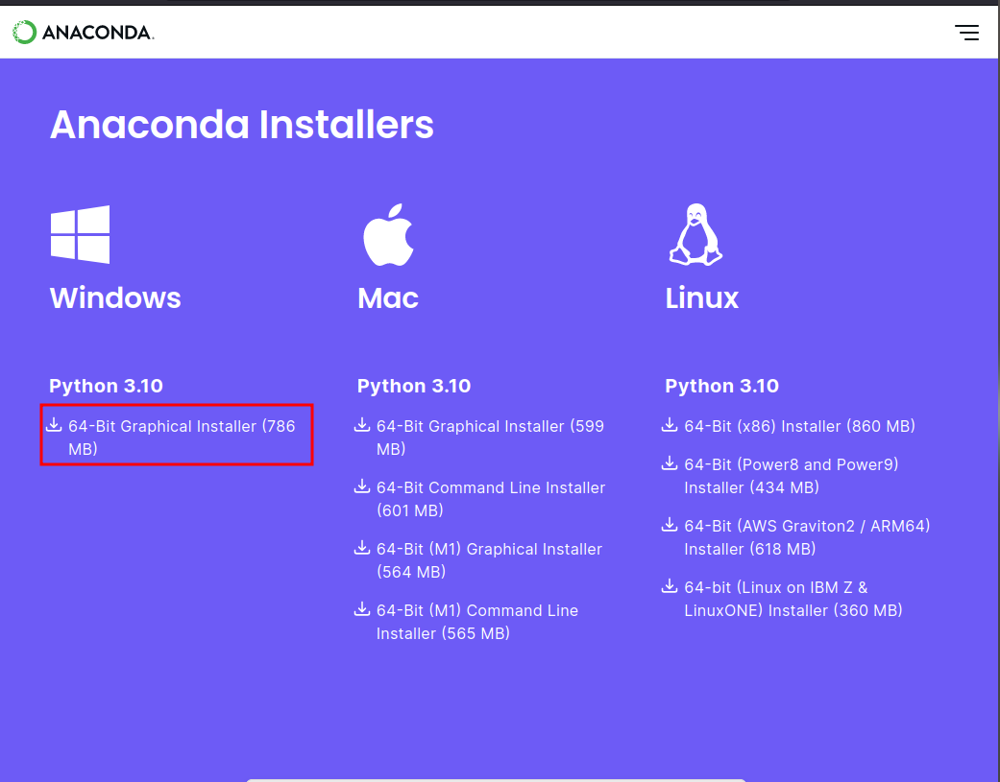
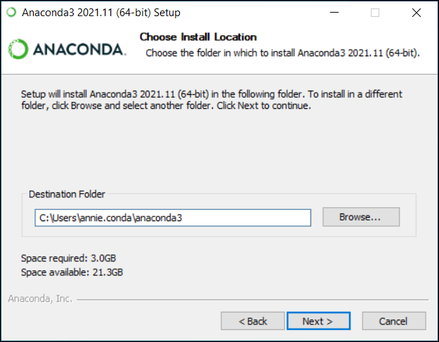
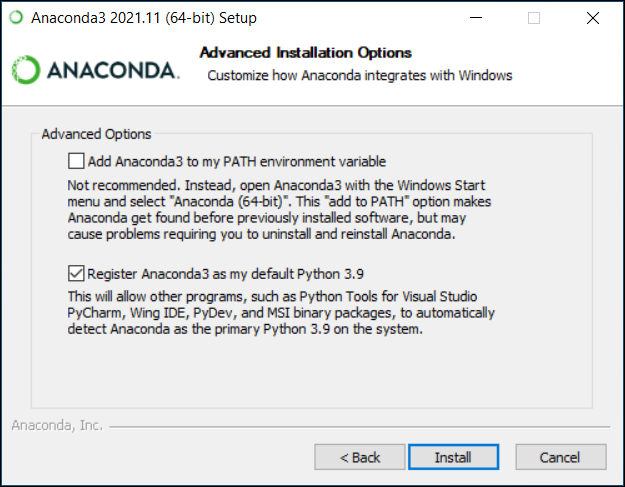
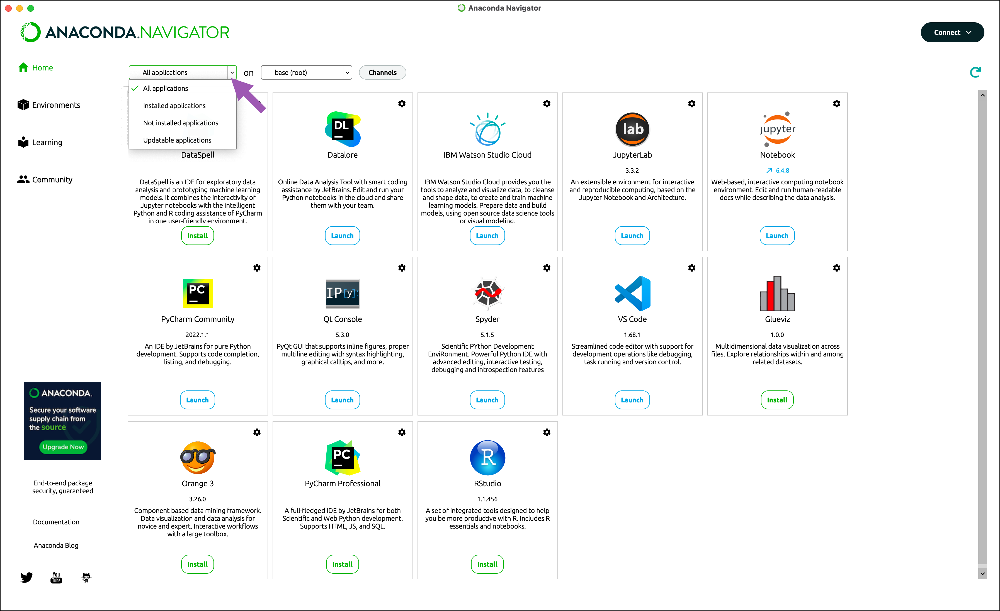

# Instalación de Anaconda

[Anaconda](https://docs.anaconda.com/free/anaconda/install/windows/) es una distribución de Python que, además de Python, instala algunas bibliotecas para cómputo científico y análisis de datos, así como dos entornos de programación (Spyder y Jupyter Notebooks). Las bibliotecas preinstaladas incluyen Numpy, SciPy, Pandas, Matplotlib, Scikit-learn, Seaborn, etc. Por esta razón, es la forma preferida de instalar Python para estos usos, y es la que usaremos en el taller.

Se instala en Windows siguiendo los siguientes pasos:

1. Descargar el instalador de Anaconda de https://www.anaconda.com/download#downloads y descarga el instalador de Anaconda para Windows (64bits). En caso de usar otro sistema operativo (como Mac), las instrucciones son similares.

  

2. Ejecutar el instalador haciendo doble clic en el archivo del instalador para comenzar la instalación. 

3. Sigue las instrucciones del instalador. En el punto en el que te pida leer los términos de la licencia, da click en *I Agree*.

4. Cuando te dé la opción de instalar para todos los usuarios o solo para ti, selecciona *Just Me* (Recomendable).

5. Selecciona la ubicación de instalación. Puedes elegir la ubicación predeterminada o seleccionar una diferente si lo prefieres.

  

6. Selecciona las opciones de configuración avanzada: Durante el proceso de instalación, se te presentarán algunas opciones de configuración avanzada. No es recomendable añadir Anaconda3 como "PATH variable" dado que podría interferir con otro software. Selecciona la opción por default.

  

7. Completa la instalación: Haz clic en "Install" para comenzar la instalación. Una vez que la instalación esté completa, deberías poder usar Anaconda en tu computadora.

8. Verifica la instalación. Busca si la aplicación Anaconda aparece entre las opciones de software instalado. Por ejemplo, dando click a la tecla de Windows (o Inicio) y tecleando "Anaconda". Si le das click, debería abrirse el siguiente icono (llamado Anaconda-navigator)

  

Luego de cargarse, mostrará la siguiente pantalla con diversas aplicaciones

  

En el taller, estaremos usando Jupyter Notebook. Si le das click, se abrirá una instancia de Jupyter Notebook en tu navegador predeterminado. Eso es normal. Las instrucciones para comenzar las veremos al inicio del taller.